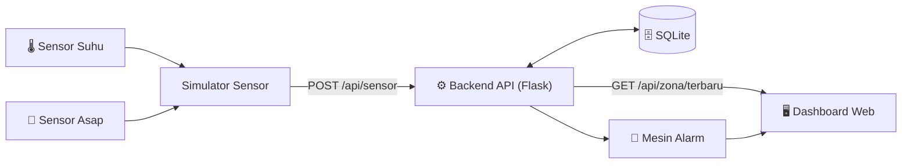

<div align="center">

# 🏭 WareTwin

### Digital Twin Gudang — Pemantauan Suhu & Asap Secara Real-Time

*Kembaran digital yang menjaga gudang tetap aman, sebelum api sempat menyala.*

-2ea44f?style=for-the-badge)


</div>

---

## ✨ Tentang Proyek

**WareTwin** adalah aplikasi *digital twin* untuk gudang. Setiap zona di gudang (rak, ruang penyimpanan, area bongkar muat) punya **kembaran digital** di layar yang menampilkan kondisi aslinya: **suhu** dan **kadar asap**.

Kalau ada zona yang mulai panas atau berasap, kembaran digitalnya langsung berubah warna dan sistem mencatat alarm, sehingga potensi kebakaran bisa terdeteksi lebih dini.

> 💡 Data sensor pada tahap ini **disimulasikan** lewat program simulator, dengan struktur yang siap diganti sensor sungguhan (mis. MQ-2 dan DHT22).

---

## 🎯 Fitur Utama

| | Fitur | Deskripsi |
|---|---|---|
| 🌡️ | **Monitoring Suhu** | Suhu tiap zona gudang diperbarui berkala |
| 💨 | **Monitoring Asap** | Kadar asap (ppm) tiap zona dipantau terus-menerus |
| 🚦 | **Status Tiga Level** | Aman 🟢 · Waspada 🟡 · Bahaya 🔴 |
| 🚨 | **Alarm Otomatis** | Setiap kondisi bahaya tercatat lengkap dengan waktu |
| 📈 | **Riwayat & Grafik** | Tren suhu dan asap per zona |
| 🗺️ | **Denah Interaktif** | Tampilan gudang yang berubah warna sesuai kondisi |

---

## 🚦 Ambang Batas Status

| Status | Suhu | Kadar Asap |
|---|---|---|
| 🟢 **Aman** | < 35 °C | < 300 ppm |
| 🟡 **Waspada** | 35 – 45 °C | 300 – 600 ppm |
| 🔴 **Bahaya** | > 45 °C | > 600 ppm |

Ambang batas bisa diubah admin per zona.

---

## 🏗️ Arsitektur Sistem



Detail lengkap ada di [System Design](docs/system-design.md).

---

## 📄 Dokumen Sprint 1

| # | Dokumen | Keterangan |
|---|---|---|
| 1 | 📋 [Project Charter](docs/project-charter.md) | Latar belakang, tujuan, ruang lingkup, risiko |
| 2 | 🧮 [Perhitungan Function Point](docs/function-point.md) | Estimasi ukuran fungsionalitas aplikasi |
| 3 | 📝 [Product Backlog & Sprint 1 Backlog](docs/product-backlog.md) | User story dan target pekerjaan |
| 4 | 🧩 [System Design](docs/system-design.md) | Arsitektur, flowchart, dan ERD |
| 5 | 🎨 [Desain UI/UX](docs/ui-design.md) | Wireframe, palet warna, dan alur pengguna |

---

## 📁 Struktur Repository

```
Digital-Twin-RPL/
├── README.md
├── docs/
│   ├── project-charter.md
│   ├── function-point.md
│   ├── product-backlog.md
│   ├── system-design.md
│   └── ui-design.md
├── backend/        ← API & simulator sensor
├── frontend/       ← dashboard web
└── database/       ← skema & data awal
```

---

## 🚀 Cara Menjalankan

> Bagian ini berlaku setelah *project setup* di folder `backend/` selesai.

```bash
# 1. Clone repository
git clone https://github.com/Arby2464/Digital-Twin-RPL.git
cd Digital-Twin-RPL/backend

# 2. Install kebutuhan
pip install flask flask-cors requests

# 3. Jalankan API
python app.py

# 4. Di terminal lain, jalankan simulator sensor
python simulator.py
```

API aktif di `http://127.0.0.1:5000`.

---

## 🗓️ Roadmap

- [x] **Sprint 1** — Perencanaan, desain, dan project setup
- [ ] **Sprint 2** — API sensor, database, dan logika status
- [ ] **Sprint 3** — Dashboard denah gudang dan grafik riwayat
- [ ] **Sprint 4** — Alarm, pengujian, dan **Product Release**

---

## 👥 Tim

| Nama | Peran | Fokus Sprint 1 |
|---|---|---|
| **Ayam** | Anggota | Project Charter & Product Backlog |
| **Arby** | Anggota | Project Setup & System Design |
| **[Nama Anggota 3]** | Anggota | Function Point & Desain UI/UX |

---

<div align="center">

**Universitas Samudera** · Program Studi Informatika
Mata Kuliah Rekayasa Perangkat Lunak · 2026

*Dibuat dengan ☕ dan sedikit rasa panik menjelang deadline.*

</div>
