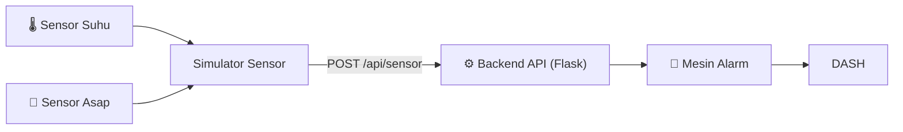
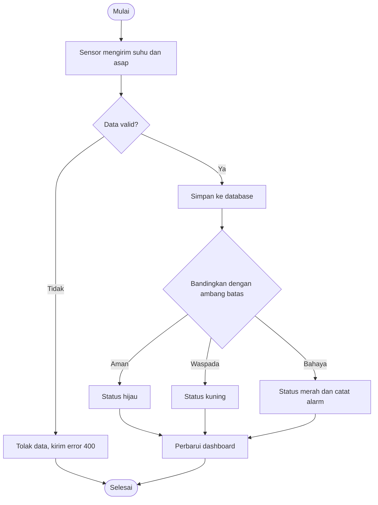
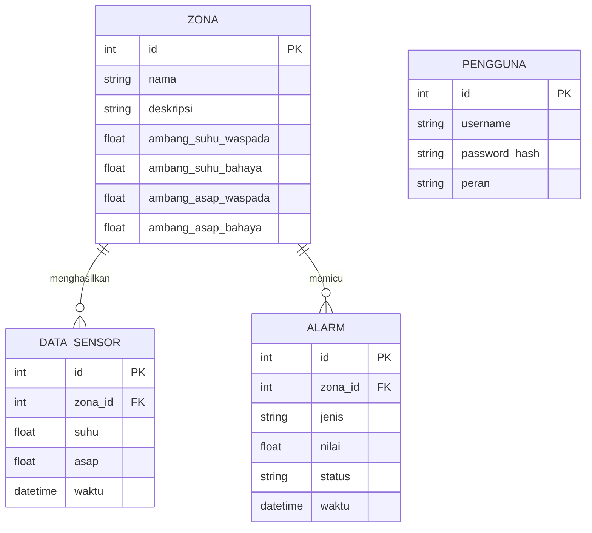

# 🧩 System Design — DTG

> Rancangan arsitektur, alur proses, dan struktur database. Diagram di bawah tampil otomatis di GitHub.

---

## 1. 🏗️ Arsitektur Sistem



| Komponen | Fungsi |
|---|---|
| **Sensor Suhu & Asap** | Sumber data kondisi gudang (tahap ini disimulasikan) |
| **Simulator Sensor** | Program Python yang mengirim data acak secara berkala |
| **Backend API (Flask)** | Menerima, memvalidasi, dan menyajikan data |
| **Mesin Alarm** | Membandingkan data dengan ambang batas dan mencatat alarm |
| **Dashboard Web** | Menampilkan kembaran digital gudang |

---

## 2. 🔄 Alur Proses Data Sensor (Flowchart)



---

## 3. 🗄️ Rancangan Database (ERD)



### Kamus Data Singkat

| Tabel | Isi |
|---|---|
| `zona` | Daftar area gudang beserta ambang batasnya |
| `data_sensor` | Riwayat pembacaan suhu (°C) dan asap (ppm) |
| `alarm` | Catatan kejadian saat kondisi bahaya |
| `pengguna` | Akun admin |

---

## 4. 🔌 Rancangan Endpoint API

| Method | Endpoint | Fungsi |
|---|---|---|
| `POST` | `/api/sensor` | Sensor mengirim data baru |
| `GET` | `/api/zona` | Daftar semua zona |
| `GET` | `/api/zona/terbaru` | Kondisi terkini tiap zona |
| `GET` | `/api/zona/<id>/riwayat` | Riwayat data satu zona |
| `GET` | `/api/alarm` | Daftar alarm |
| `PUT` | `/api/zona/<id>/ambang` | Ubah ambang batas zona |

**Contoh data yang dikirim sensor (JSON):**

```json
{
  "zona_id": 1,
  "suhu": 31.5,
  "asap": 120
}
```

---

## 5. 🚦 Aturan Penentuan Status

| Status | Suhu | Asap |
|---|---|---|
| 🟢 Aman | < 35 °C | < 300 ppm |
| 🟡 Waspada | 35 – 45 °C | 300 – 600 ppm |
| 🔴 Bahaya | > 45 °C | > 600 ppm |

Status akhir sebuah zona mengikuti **kondisi terburuk** dari suhu dan asap. Contoh: suhu aman tetapi asap bahaya, maka status zona adalah **Bahaya**.
