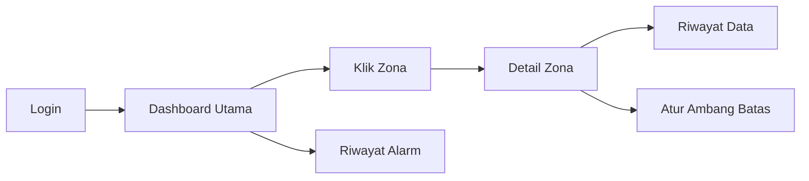

# 🎨 Desain UI/UX — DTG

> Rancangan tampilan aplikasi: gaya visual, warna, wireframe, dan alur pengguna.

---

## 1. ✨ Konsep

**Tema:** modern, bersih, dan elegan dengan mode gelap agar warna status mudah menonjol dan '"DINGINNNN".

**Prinsip:**
- **Sekilas paham**: pengguna langsung tahu zona mana yang bermasalah dari warnanya
- **Minim klik**: informasi penting ada di halaman utama
- **Konsisten**: satu warna selalu berarti satu status

---

## 2. 🎨 Palet Warna

| Fungsi | Warna | Kode |
|---|---|---|
| Latar utama | Biru gelap | `#0F172A` |
| Kartu/panel | Abu kebiruan | `#1E293B` |
| Teks utama | Putih lembut | `#F1F5F9` |
| Aksen | Biru langit | `#38BDF8` |
| 🟢 Aman | Hijau | `#22C55E` |
| 🟡 Waspada | Kuning | `#EAB308` |
| 🔴 Bahaya | Merah | `#EF4444` |

---

## 3. 🖼️ Wireframe

### 3.1 Halaman Dashboard

```
┌────────────────────────────────────────────────────────────────┐
│  🏭 WareTwin                          🟢 Sistem Aktif   👤 Admin │
├────────────────────────────────────────────────────────────────┤
│                                                                │
│  ┌──────────┐  ┌──────────┐  ┌──────────┐  ┌──────────┐        │
│  │ Total    │  │ 🟢 Aman  │  │ 🟡 Waspada│ │ 🔴 Bahaya│        │
│  │ Zona: 6  │  │    4     │  │     1     │ │     1    │        │
│  └──────────┘  └──────────┘  └──────────┘  └──────────┘        │
│                                                                │
│  ┌──────────────────────────────┐  ┌─────────────────────────┐ │
│  │        DENAH GUDANG          │  │  🚨 ALARM TERBARU       │ │
│  │                              │  │                         │ │
│  │  ┌────────┐ ┌────────┐       │  │  Zona C · Asap 720 ppm  │ │
│  │  │ Zona A │ │ Zona B │       │  │  14:32                  │ │
│  │  │  🟢    │ │  🟢    │       │  │  ─────────────────────  │ │
│  │  └────────┘ └────────┘       │  │  Zona E · Suhu 47 °C    │ │
│  │  ┌────────┐ ┌────────┐       │  │  13:10                  │ │
│  │  │ Zona C │ │ Zona D │       │  │                         │ │
│  │  │  🔴    │ │  🟢    │       │  │  [ Lihat semua ]        │ │
│  │  └────────┘ └────────┘       │  └─────────────────────────┘ │
│  │  ┌────────┐ ┌────────┐       │                              │
│  │  │ Zona E │ │ Zona F │       │                              │
│  │  │  🟡    │ │  🟢    │       │                              │
│  │  └────────┘ └────────┘       │                              │
│  └──────────────────────────────┘                              │
└────────────────────────────────────────────────────────────────┘
```

### 3.2 Halaman Zona

```
┌────────────────────────────────────────────────────────────────┐
│  ← Kembali           ZONA C — Rak Bahan Mudah Terbakar         │
├────────────────────────────────────────────────────────────────┤
│                                                                │
│  Status: 🔴 BAHAYA                                             │
│                                                                │
│  ┌───────────────────┐   ┌───────────────────┐                 │
│  │ 🌡️ Suhu           │   │ 💨 Asap           │                 │
│  │      38.2 °C      │   │     720 ppm       │                 │
│  │    🟡 Waspada     │   │    🔴 Bahaya      │                 │
│  └───────────────────┘   └───────────────────┘                 │
│                                                                │
│  Grafik 1 Jam Terakhir                                         │
│  ppm                                                           │
│  800 │                          ╭──╮                           │
│  600 │                    ╭─────╯  ╰─                          │
│  300 │  ───────────╮  ╭──╯                                    │
│    0 └──────────────┴──┴───────────────────────────► waktu     │
│                                                                │
│  [ Lihat Riwayat ]   [ Atur Ambang Batas ]                     │
└────────────────────────────────────────────────────────────────┘
```

### 3.3 Halaman Riwayat Alarm

```
┌────────────────────────────────────────────────────────────────┐
│  🚨 Riwayat Alarm                                              │
├────────────────────────────────────────────────────────────────┤
│  Filter: [ Semua Zona ▾ ]  [ Semua Status ▾ ]                  │
│                                                                │
│  Waktu        Zona     Jenis    Nilai       Status             │
│  ───────────────────────────────────────────────────────────── │
│  14:32        Zona C   Asap     720 ppm     🔴 Bahaya          │
│  13:10        Zona E   Suhu     47 °C       🔴 Bahaya          │
│  11:45        Zona B   Asap     410 ppm     🟡 Waspada         │
│  ...                                                           │
└────────────────────────────────────────────────────────────────┘
```

### 3.4 Halaman Login

```
┌────────────────────────────────────┐
│                                    │
│            🏭 DTG                 │
│      Digital Twin Gudang           │
│                                    │
│   Username  [__________________]  │
│   Password  [__________________]  │
│                                    │
│          [    Masuk    ]           │
│                                    │
└────────────────────────────────────┘
```

---

## 4. 🧭 Alur Pengguna (User Flow)



---

## 5. 📌 Catatan

- Wireframe di atas adalah rancangan awal dalam bentuk teks.
- Tampilan dibuat responsif agar nyaman dibuka di laptop maupun HP.